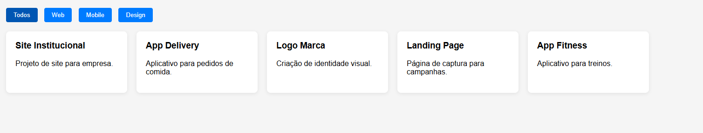

# Desafio 5 - Filtro de Portfólio

Este projeto foi desenvolvido como parte de um desafio proposto pelo professor Luan. O objetivo é criar um filtro de portfólio interativo utilizando HTML, CSS e JavaScript.

## Funcionalidades
- Filtragem dinâmica dos itens do portfólio
- Interface responsiva e moderna
- Fácil customização para diferentes tipos de projetos

## Como usar
1. Clone ou baixe este repositório.
2. Abra o arquivo `index.html` em seu navegador.
3. Explore os filtros e veja os projetos sendo exibidos conforme a seleção.

## Demonstração
Veja abaixo uma prévia do funcionamento do filtro de portfólio:

## Estrutura do projeto
- `index.html`: Página principal do portfólio
- `demo/`: Pasta contendo imagens de demonstração
- `README.md`: Este arquivo de documentação

## Autor
Desafio proposto por Professor Luan.

---

Sinta-se à vontade para modificar e aprimorar este projeto conforme suas necessidades!